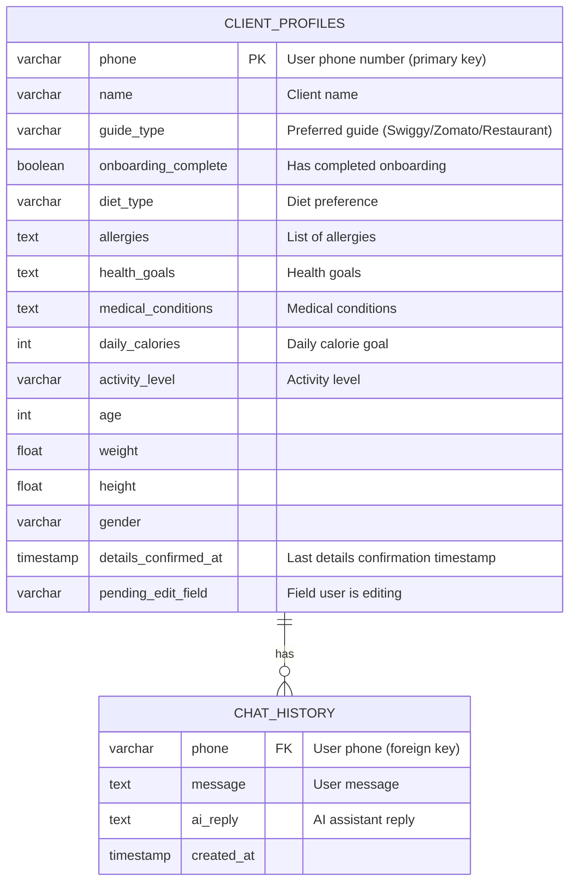

# n8n Restaurant Guide Workflow

## Executive Summary  
This document provides a thorough developer-oriented handover of the **Restaurant Guide** n8n workflow. It details the architecture, data flows, and each node’s function within the workflow, covering onboarding, intent detection, personalization, and restaurant recommendation via Swiggy/Zomato/Restaurant menu. We include diagrams (workflow execution, intent routing, ER diagram), node-by-node documentation, AI prompt engineering notes, database schemas, error handling strategies, and deployment considerations. We highlight business logic (e.g. onboarding steps, intent categories) and suggest improvements, referencing official sources for n8n, Gemini, and PostgreSQL.

## Table of Contents  
- [Workflow Overview](#workflow-overview)  
- [Architecture and Data Flow](#architecture-and-data-flow)  
  - [High-Level Workflow Diagram](#high-level-workflow-diagram)  
  - [Intent Routing Diagram](#intent-routing-diagram)  
  - [Database ER Diagram](#database-er-diagram)  
- [Node-by-Node Documentation](#node-by-node-documentation)  
- [Business Logic Mapping](#business-logic-mapping)  
- [AI Prompt Engineering](#ai-prompt-engineering)  
- [Database Documentation](#database-documentation)  
- [Error Handling & Retry Strategies](#error-handling--retry-strategies)  
- [Deployment Notes](#deployment-notes)  
- [Security and Privacy Considerations](#security-and-privacy-considerations)  
- [Performance and Scalability](#performance-and-scalability)  
- [Future Enhancements](#future-enhancements)  
- [Node Comparison Table](#node-comparison-table)  
- [Sources](#sources)  

## Workflow Overview  
The workflow is triggered by incoming WhatsApp messages via a **Webhook**. It validates the message, parses content (text, images, PDFs, button clicks), and applies business logic: profile onboarding, intent detection, and personalized restaurant recommendations. Key features include:  
- **Onboarding**: Collects user profile details (name, guide type, diet, allergies, conditions, goals) over multiple steps.  
- **Intent Detection**: Classifies messages (greeting, dietary query, nutrition query, etc.) using a code node.  
- **Restaurant Recommendation Flows**: Users choose between *Swiggy, Zomato,* or *direct Restaurant menu*. The system handles each option with tailored prompts.  
- **AI Integrations**: Utilizes Google’s Gemini 2.5 Flash-Lite model (via HTTP request) for answering user queries, image/pdf analysis, and validating input.  
- **Database**: A PostgreSQL (via Supabase) backend stores `client_profiles` and `chat_history`. The workflow queries and updates these tables at various points.  

Workflow summary: Webhook → Signature check (HMAC) → If validation passes: parse message → split logic (reschedule or payment replies) → route to onboarding or intent logic → fetch/merge user data → run AI/logic nodes → send WhatsApp response.

## Architecture and Data Flow  

### High-Level Workflow Diagram  
Below is a simplified flowchart of the main execution path. It shows triggers, branching, and major processing steps.  

```mermaid
flowchart LR
  subgraph "Incoming WhatsApp Message"
    W[Webhook<br/>(message from user)]
    C[Crypto (HMAC validation)]
    V{Validate Webhook} 
  end
  W --> C --> V
  V -- valid --> ParseIncoming
  V -- invalid --> End[(Stop)]

  subgraph "Parse & Extract"
    ParseIncoming[Code: Parse Incoming Message]
    ExtractReply[Code: Extract Reply Info]
  end
  V --> ParseIncoming
  V --> ExtractReply

  subgraph "Reschedule / Payment Checks"
    IsReschedule{Is Reschedule?}
    ZohoPayment{Is Zoho Payment Button?}
    FetchClient[DB: Fetch client_details]
    AskSlots[HTTP: Ask Preferred Slots]
    ConstructZoho[Code: Construct Zoho Message]
    DoNothing[Code: Attend – Do Nothing]
  end
  ExtractReply --> IsReschedule
  ExtractReply --> ZohoPayment
  IsReschedule -- true --> FetchClient --> AskSlots
  IsReschedule -- false --> DoNothing
  ZohoPayment -- true --> ConstructZoho
  ZohoPayment -- false --> DoNothing

  subgraph "Intent and User Data Fetch"
    Switch1[Switch: Location/Appointment/Extra]
    FetchClientProfiles[DB: Fetch client detail]
    FetchChatHistory[DB: Fetch Chat History]
    DetectIntent[Code: Detect Intent]
    MergeBranches[Merge (3 inputs)]
    FormatMerge[Code: Format and Merge Data]
  end
  ParseIncoming --> Switch1
  Switch1 --> |Location| LocationBranch[/No action defined/]
  Switch1 --> |Appointment| AppointmentBranch[/No action defined/]
  Switch1 --> |Default| FetchClientProfiles & FetchChatHistory & DetectIntent
  FetchClientProfiles --> MergeBranches
  FetchChatHistory --> MergeBranches
  DetectIntent --> MergeBranches
  MergeBranches --> FormatMerge

  subgraph "Trigger & Onboarding Check"
    CheckTrigger[Code: check trigger (keyword/button gating)]
    OnboardCheck{Onboarding Complete?}
    TriggerKeyIF[If: Keyword for new user]
    TriggerKey[Code: check trigger key]
    InitOnboard[DB: Init Onboarding (INSERT)]
    OnboardHandler[Code: Onboarding Handler]
  end
  FormatMerge --> CheckTrigger --> OnboardCheck
  OnboardCheck -- false --> TriggerKeyIF --> TriggerKey --> InitOnboard --> OnboardHandler --> IsBtn
  OnboardCheck -- true --> CheckDetails
  TriggerKeyIF --> TriggerKey

  subgraph "Onboarding Flow"
    IsBtn{ignoreExecution?}
    ValidationErr{validationError?}
    SendOnboardMsg[HTTP: send onboarding message]
    SaveStep[DB: Save Onboarding Step]
    GuideSwitch[Switch: guide_card]
    DietType[HTTP: diet type (list selection)]
    HealthGoal[DB: get health goal]
    ShowGuides[HTTP: diet type3 (final prompt)]
    ConfirmDetails[If: Check Details Confirmed]
  end
  OnboardHandler --> IsBtn
  IsBtn -- false --> ValidationErr
  IsBtn -- true --> EndExec[(Drop execution)]
  ValidationErr -- true --> SendOnboardMsg
  ValidationErr -- false --> SaveStep --> GuideSwitch
  GuideSwitch -- guide_card --> DietType
  GuideSwitch -- send_details --> HealthGoal --> ShowGuides
  GuideSwitch -- extra --> SendOnboardMsg

  subgraph "Post-Onboarding: Daily Run"
    ConfirmDetails --> RouteConfirm
    RouteConfirm -- show_card --> ConfirmCard[HTTP: confirm_card (Yes/No buttons)]
    RouteConfirm -- confirmed_yes --> UpdateDetails[DB: Update Details Confirmed]
    UpdateDetails --> RouteGuide
    RouteConfirm -- confirmed_no --> EditButtons[HTTP: Send Edit Field Buttons]
    RouteConfirm -- edit_field_selected --> AskNewVal[HTTP: Ask New Value]
    RouteConfirm -- save_edit --> SaveEdit[DB: Save Edited Value]
    RouteConfirm -- guide_selected --> RouteGuide
    RouteGuide --> |Swiggy| Swiggy[HTTP: Swiggy query]
    RouteGuide --> |Zomato| Zomato[HTTP: Zomato query]
    RouteGuide --> |Restaurant| AskMenu[HTTP: ask_menu (upload prompt)]
  end
```

*Figure: Workflow execution flowchart.* The diagram above shows the overall execution sequence. It starts with the Webhook trigger, then splits into onboarding vs. intent handling branches. (Location/Appointment branches are currently placeholders with no defined nodes.)

### Intent Routing Diagram  
This flowchart highlights how incoming user messages are routed by intent. The **Switch1** node first checks for keywords (`location`, `appointment`), falling back to default. The merged data then goes through the **Detect Intent** code node, which classifies intents (greeting, diet query, etc.) based on content (using keyword matching and context). The identified intent guides the conversation logic (e.g. whether to handle an image, handle greetings, or fetch a restaurant suggestion).  

```mermaid
flowchart TB
  UserMsg[User Message: text, image, button click]
  Switch1{Switch1: check "location"/"appointment"}
  FetchProfiles[DB: fetch client profile]
  FetchHistory[DB: fetch chat history]
  DetectIntent[Code: detect intent]
  MergeBranches[Merge: combine data]
  FormatMerge[Code: format user profile & context]
  OnboardingLogic[Onboarding Decision]
  AIQuery[LLM/Gemini Queries]
  Recommendation[Restaurant Recommendation Flow]

  UserMsg --> Switch1
  Switch1 -->|Location Keywords| LocationFlow[/Location flow (unspecified)/]
  Switch1 -->|Appointment| AppointmentFlow[/Appointment flow (unspecified)/]
  Switch1 -->|Default| FetchProfiles & FetchHistory & DetectIntent
  FetchProfiles --> MergeBranches
  FetchHistory --> MergeBranches
  DetectIntent --> MergeBranches
  MergeBranches --> FormatMerge --> OnboardingLogic --> AIQuery --> Recommendation
```

*Figure: Intent routing flow. Switch1 directs certain keyword queries separately; otherwise, the workflow collects user profile, history, and intent before proceeding to onboarding or recommendation logic.* (Location/Appointment paths are currently not implemented.)

### Database ER Diagram  
The workflow uses two key PostgreSQL tables. The **client_profiles** table stores user data collected during onboarding, and **chat_history** logs past interactions. The ER diagram below shows their relationship:  



*Figure: Entity-Relationship diagram. A client can have many chat_history entries (one-to-many). Key fields of each table are shown.*  

## Node-by-Node Documentation  
Below is a detailed breakdown of each major node. Unspecified behavior or prompts in the JSON are noted as such.

- **Webhook** (Trigger; Path: `/whatsapp-webhook`, Method: POST)  
  **Purpose:** Listens for incoming WhatsApp messages (via ChatSpire/Connect API). Receives the raw HTTP request.  
  **Inputs:** None (start of workflow).  
  **Outputs:** Raw JSON in `body`.  
  **Parameters:** Path is `/whatsapp-webhook`, method `POST`, RawBody enabled.  
  **Connected Nodes:** Passes output to **Crypto** node.  
  **Notes:** RawBody=True yields binary or JSON payload (text, images, etc.).

- **Crypto** (n8n Code: SHA256 HMAC; uses `binaryData: true`)  
  **Purpose:** Verifies message signature for authenticity.  
  **Inputs:** Webhook output (`binary.data` or `body`).  
  **Outputs:** JSON with computed HMAC if valid.  
  **Parameters:** HMAC action, SHA256, secret from environment (compare with `X-Hub-Signature`).  
  **Connected Nodes:** If signature check passes, goes to **validate webhook**.  
  **Error Handling:** If signature invalid, workflow stops (no output).  

- **validate webhook** (n8n If node)  
  **Type:** Boolean check node.  
  **Purpose:** Checks two conditions: (1) Crypto hash matches expected signature, and (2) message topic equals `"message.sender.user"`.  
  **Inputs:** JSON from **Crypto**.  
  **Outputs:** True branch or false (only true is shown).  
  **Parameters:** Conditions use expressions to compare `$json.hash` and `$json.body.data.webhookSignature`.  
  **Connected Nodes (True):** **Parse Incoming Message**, **Extract Reply Info**.  
  **Connected Nodes (False):** *(None)* – if false, execution stops (message ignored).  

- **Parse Incoming Message** (Code node)  
  **Type:** Custom JS (n8n-nodes-base.code).  
  **Purpose:** Normalizes WhatsApp message content. Extracts fields like `from`, `text`, `imageId`, `documentId`, `buttonReplyId`, and flags (`hasImage`, `hasPdf`, `isButtonReply`). Sets default values.  
  **Inputs:** JSON from webhook (via validate).  
  **Outputs:** Single JSON with fields: 
  ```json
  {
    "from": string,
    "type": string,
    "text": string,
    "imageId": string|null,
    "hasImage": bool,
    "documentId": string|null,
    "hasPdf": bool,
    "buttonReply": string|null,
    "buttonReplyId": string|null,
    "isButtonReply": bool,
    "messageId": string,
    "displayName": string,
    "phoneNumberId": string
  }
  ```  
  **Key Logic:** Ignores non-user sender (`sender != "USER"`). Distinguishes message types (`TEXT`, `IMAGE`, `DOCUMENT`, `BUTTON_REPLY`, `LIST_REPLY`). If message text is `"guide"`, sets `buttonReplyId='n8n_edit_guide'`.  
  **Expressions/Code:** Uses JavaScript to build output JSON. Returns `[]` (no output) for non-handled types.  
  **Connected Nodes:** **Switch1** (default message logic).  
  **Dependencies:** Receives validated message.  
  **Sample Payload:**  
    ```json
    {
      "from": "1234567890",
      "text": "hi there",
      "type": "TEXT",
      "imageId": null,
      "hasImage": false,
      "documentId": null,
      "hasPdf": false,
      "buttonReply": null,
      "buttonReplyId": "",
      "isButtonReply": false,
      "messageId": "ABCD",
      "displayName": "John Doe",
      "phoneNumberId": "xyz"
    }
    ```  

- **Extract Reply Info** (Code node)  
  **Purpose:** Extracts meta-info from replies (for use in follow-up flows).  
  **Inputs:** Same webhook JSON.  
  **Outputs:** JSON with fields: 
  ```json
  {
    "replyId": string|null,
    "replyTitle": string|null,
    "fromPhone": string,
    "contextId": string|null,
    "messageId": string,
    "userName": string,
    "topic": string,
    "isButtonReply": bool
  }
  ```  
  **Key Logic:** Grabs `msg.message_content.id/text`, `phone_number`, `context.id`, etc.  
  **Connected Nodes:** **Is Reschedule?** and **Is Zoho Payment?** branches (via parallel execution).  
  **Sample Payload:** e.g.
    ```json
    { "replyId": "n8n_reschedule_meeting", "fromPhone": "1234567890", "userName": "John Doe", ... }
    ```  

- **Is Reschedule?** (If node)  
  **Purpose:** Checks if the incoming reply was the “Reschedule Meeting” button.  
  **Inputs:** JSON from **Extract Reply Info**.  
  **Condition:** `$json.replyId === 'n8n_reschedule_meeting'`.  
  **Outputs:** True or False branch.  
  **Connected (True):** **fetch client details**, **WA: Ask Preferred Slots (Client)**.  
  **Connected (False):** **Attend — Do Nothing**.  

- **Is Zoho Payment Button?** (If node)  
  **Purpose:** Detects Zoho payment-related button replies (IDs like `'n8n_zoho_paid'`, etc.).  
  **Condition:** Regex match on `$json.replyId`.  
  **Outputs:** True or False.  
  **Connected (True):** **Construct Zoho Message** (builds custom response).  
  **Connected (False):** *(none)* – ignored.  

- **fetch client details** (Postgres node)  
  **Type:** SQL query.  
  **Purpose:** Retrieves user profile from `client_profiles` by phone.  
  **Inputs:** `$json.from` (phone number).  
  **Query:** `SELECT * FROM client_profiles WHERE phone='{{ $json.from }}';`  
  **Outputs:** JSON record of user profile (fields like name, diet_type, allergies, etc.).  
  **Connected:** Merges into **Merge All Branches** at input index 0.  

- **WA: Ask Preferred Slots (Client)** (HTTP Request)  
  **Purpose:** Sends a WhatsApp message asking user for preferred reschedule slots (via ChatSpire API).  
  **Inputs:** `$node['Extract Reply Info'].json.userName`, phone `$json.from`.  
  **Request:** `POST https://connect.api-wa.co/.../messages` with JSON body including `text: "When would you prefer to reschedule your meeting?"`.  
  **Outputs:** ChatSpire API response (ignored).  
  **No outputs to further nodes (end of branch).**  

- **Attend — Do Nothing** (Code)  
  **Purpose:** Dummy endpoint to stop processing for unrelated messages.  
  **Logic:** Returns empty result to terminate.  
  **Outputs:** None (workflow branch ends).  

- **Switch1** (Switch node)  
  **Purpose:** Classifies plain-text queries by keywords:  
    - *Location* (regex `/location|address|clinic|visit|your location|where|place|map/i`)  
    - *Appointment* (`/appointment|booking|consultation|slot|schedule/i`)  
    - *Extra* (fallback).  
  **Inputs:** `$json.text` from **Parse Incoming Message**.  
  **Outputs:** Three branches: **Location**, **Appointment**, **Extra**.  
  **Connected (Location):** *(no nodes defined)*.  
  **Connected (Appointment):** *(no nodes defined)*.  
  **Connected (Extra):** **Fetch client detail**, **Fetch Chat History**, **Detect Intent**.  

- **Fetch client detail** (Postgres node)  
  **Purpose:** Same as earlier; selects profile from `client_profiles` by phone.  
  **Query:** `SELECT * FROM client_profiles WHERE phone='{{ $json.from }}';`  
  **Connected:** Goes to **Merge All Branches** at input index 0.  

- **Fetch Chat History** (Postgres node)  
  **Purpose:** Retrieves recent chat from `chat_history`.  
  **Query:** 
    ```sql
    SELECT message, ai_reply
    FROM chat_history
    WHERE phone='{{ $json.from }}'
    ORDER BY created_at DESC
    LIMIT 3;
    ```  
  **Outputs:** Array of last up to 3 (message, ai_reply) pairs.  
  **Connected:** Goes to **Merge All Branches** at index 1.  

- **Detect Intent** (Code node)  
  **Purpose:** Determines user intent label based on message content and flags.  
  **Inputs:** `$json` containing parsed message plus profile context.  
  **Logic:** 
    - If `hasImage` or `imageId` → intent = `"image_analysis"`.  
    - Else if `hasPdf` or `documentId` → `"pdf_analysis"`.  
    - Else if very short greeting-like message with no diet keywords → `"greeting"`.  
    - Else if contains diet/food terms → `"diet_query"`.  
    - Else if nutrition terms (calories, macros) → `"nutrition_query"`.  
    - Else if weight/goal terms → `"goal_query"`.  
    - Else if allergy terms → `"allergy_query"`.  
    - Else if health condition terms (diabetes, thyroid, etc.) → `"health_query"`.  
    - Else if progress terms → `"progress_query"`.  
    - Else if non-empty text → `"general"`.  
    - If `isButtonReply`, certain button IDs override to `"confirm_reply"`.  
    - Default: `"unknown"`.  
  **Outputs:** Same JSON with an added `intent` field.  
  **Connected:** Goes to **Merge All Branches** at index 2.  
  **Notes:** This code-driven classification uses inexact string matching and phrases.  

- **Merge All Branches** (Merge node; 3 inputs)  
  **Purpose:** Combines the three branches (client detail, chat history, intent).  
  **Operation:** MergeInputs (concatenates arrays by index).  
  **Inputs:** Outputs of *Fetch client detail*, *Fetch Chat History*, *Detect Intent*.  
  **Outputs:** Array containing all items from inputs as separate entries.  
  **Connected:** **Format and Merge Data**.  

- **Format and Merge Data** (Code node)  
  **Purpose:** Consolidates merged data into a single unified JSON object. It picks out fields from each branch and builds a profile/context.  
  **Inputs:** `$input.all()` with up to 3 items.  
  **Logic:**  
    - Identifies branches by presence of fields: 
      - If `j.intent` exists → use as *intentData*.  
      - If `j.onboarding_step` exists → use as *clientDetail*.  
      - If `j.message` exists → append to *chatRows*.  
    - Builds `chatHistory` string from last messages.  
    - Extracts or defaults profile fields (`clientName`, `allergies`, `healthGoals`, `dietPlan`, etc.).  
    - Includes debugging flags (`zoconutFound`, `clientDetailFound`, etc.).  
  **Outputs:** Single JSON with keys: 
  ```json
  {
    from, text, type, imageId, hasImage, documentId, hasPdf, displayName, phoneNumberId,
    buttonReply, buttonReplyId, isButtonReply,
    intent,
    clientName, phone_num, guideType, allergies, last_suggested_online, last_suggested_menu,
    healthGoals, dietPlan, calories, menuList, medicalConditions, activityLevel, age,
    weight, height, gender, onboardingComplete, onboarding_step, chatHistory,
    detailsConfirmedAt, details_confirmed_at, pending_edit_field,
    _debug: { zoconutFound, clientDetailFound, chatRowsCount, intentDetected }
  }
  ```  
  **Notes:** Many fields come from the database or defaults. If `intentData` is missing, `intent` defaults to `"none"`.  
  **Connected:** **check trigger**.  

- **check trigger** (Code)  
  **Purpose:** Gatekeeping logic to determine if workflow should proceed. Ensures only relevant interactions (media, known buttons, edits, or restaurant keywords) pass through after onboarding.  
  **Inputs:** Output of Format Merge Data.  
  **Logic:**  
    1. Defines lists of `registeredButtons` (IDs used in workflow) and `zohoButtons`.  
    2. Sets flags: `isRegisteredButton`, `isCurrentlyEditing`, `isMediaUpload` (image/PDF present).  
    3. Checks text keywords (`restaurant`, `swiggy`, `zomato`, etc.).  
    4. If `onboardingComplete` is true: requires one of (media upload, registered button, active edit, keyword) to continue; else returns `[]` (stop).  
    5. If onboarding incomplete: drop if Zoho button clicked, else continue.  
  **Outputs:** Either `[item]` (to proceed) or `[]` (halt).  
  **Connected:** **Onboarding Complete?** (if returned item).  

- **Onboarding Complete?** (If node)  
  **Purpose:** Branches based on whether the user has finished onboarding (`$json.onboardingComplete == true`).  
  **Inputs:** Output from **check trigger**.  
  **Outputs:** True or False.  
  **Connected (True):** **Check Details Confirmed**.  
  **Connected (False):** **check trigger key if** and **check trigger key** (begin onboarding flow).  

- **check trigger key if** (If node)  
  **Purpose:** Checks if a new user typed a known “trigger word” (e.g. `restaurant`, `cafe`, etc.) to start interaction.  
  **Condition:** `$input.json.text` contains any of `['restaurant','cafe','hotel','dineout','dineout']`.  
  **Outputs:** Always empties (the main path is empty, effectively a no-op).  
  **Connected:** None (used to allow pass to the next node).  

- **check trigger key** (Code)  
  **Purpose:** Allows new or existing users to proceed through onboarding or normal flow if appropriate triggers are present. It filters out random messages from unknown numbers.  
  **Inputs:** Output from previous nodes.  
  **Logic:**  
    - If **onboardingComplete**, immediately allow (`return item`).  
    - If phone exists (`recordExists`):  
      - If button reply with prefix `n8n_`, allow; else drop unrelated buttons; allow any text reply.  
    - If no record (new user):  
      - If `n8n_` button, allow; else if text matches allowed triggers, allow; else drop.  
  **Outputs:** Either `{json:item}` (continue) or `[]` (stop).  
  **Connected (continue):** **Init Onboarding**.  

- **Init Onboarding** (Postgres node)  
  **Purpose:** Creates or ensures a client profile row.  
  **Query:**  
  ```sql
  INSERT INTO client_profiles (phone, onboarding_step, onboarding_complete)
  VALUES ('{{ $json.from }}', 'ask_name', false)
  ON CONFLICT (phone) DO NOTHING;
  ```  
  **Outputs:** (No output; it just inserts if new).  
  **Connected:** **Onboarding Handler**.  
  **Settings:** `retryOnFail: true` (up to 3 tries) ensures resilience.  

- **Onboarding Handler** (Code node)  
  **Purpose:** Manages the interactive onboarding steps. Based on the user’s current `onboarding_step` in profile and input, it generates the next prompt and update query.  
  **Inputs:** Uses output from **Format and Merge Data** (which contains profile + user message).  
  **Logic:**  
    - Retrieves `step` (current onboarding_step, default “ask_name”) and user message.  
    - Defines a list of onboarding steps: ask_name, ask_diet, ask_allergies, ask_conditions, ask_healthgoal.  
    - If user pressed a guide button during onboarding steps, return with `ignoreExecution` to skip handling (this stops execution for that run).  
    - Performs basic AI validation (calls to `Gemini Validation` are commented out but logic checks `aiResponse == "OFF_TOPIC"` or `"INVALID"`) and may produce generic prompts.  
    - **Step handlers** (if not off-topic/invalid):  
      - **ask_name**: If input is too short or looks like greeting, ask again: “May I know your *Name* please?”; otherwise, save name (`name = aiResponse`), set next step `'ask_guide_type'`, reply “Nice to meet you, *Name*!” and set `matchedValue="SEND_GUIDE_BUTTONS"`.  
      - **ask_guide_type**: Check if user clicked a button (`n8n_swiggy`, `n8n_zomato`, `n8n_restaurant`) or typed a valid choice. If invalid, ask again. If valid, update `guide_type`, step to `'ask_diet'`, reply with diet options (Veg/NonVeg/Jain/Eggetarian).  
      - **ask_diet**: Map numbers 1–4 or names to diet; if invalid, ask again. On success, update `diet_type`, step `'ask_allergies'`, prompt for allergies.  
      - **ask_allergies**: Accepts comma-separated list or “None” (stored as JSON array). Update `allergies`, step `'ask_conditions'`, prompt for medical conditions.  
      - **ask_conditions**: Similar to allergies; update `medical_conditions`, step `'ask_healthgoal'`, prompt for health goals.  
      - **ask_healthgoal**: Parse health goals list or none; update `health_goals`, mark `onboarding_complete=true`. Reply “✅ *Profile setup complete!*” and set `send_details=true`.  
    - If none match, resets to ask_name.  
  **Outputs:** JSON with keys: 
    ```json
    {
      "from": phone,
      "replyMessage": string,
      "updateQuery": string,
      "matchedValue": string,
      "validationError": bool,
      "currentStep": step,
      "phoneNumberId": ...,
      "send_details": bool,
      "ignoreExecution": bool
    }
    ```  
  **Connected:** **is_btn**.  
  **Example:** After collecting name, it might output:  
    ```json
    {
      "from": "1234567890",
      "replyMessage": "Nice to meet you, *Alice*! 😊",
      "updateQuery": "UPDATE client_profiles SET name='Alice', onboarding_step='ask_guide_type' WHERE phone='1234567890';",
      "matchedValue": "SEND_GUIDE_BUTTONS",
      "validationError": false,
      "currentStep": "ask_name"
    }
    ```  

- **is_btn** (If node)  
  **Purpose:** Checks `ignoreExecution` flag from Onboarding Handler. This flag is true when we should skip sending a message.  
  **Inputs:** JSON from Onboarding Handler.  
  **Condition:** `$json.ignoreExecution == true`.  
  **Outputs:**  
    - True branch (if ignoreExecution is true) has **no nodes** – it effectively ends this execution path.  
    - False branch (default) proceeds to **validationError**.  

- **validationError** (If node)  
  **Purpose:** Checks if the onboarding input was invalid (`validationError` true).  
  **Condition:** `$json.validationError == true`.  
  **Outputs:**  
    - True → **send onboarding message**  
    - False → **Save Onboarding Step**  

- **send onboarding message** (HTTP Request)  
  **Purpose:** Sends the `replyMessage` (for onboarding) via WhatsApp API.  
  **Method/URL:** `POST https://connect.api-wa.co/project-apis/v1/project/<projectID>/messages`  
  **Headers:** `Accept: application/json`, `X-API-WA-Project-API-Pwd: <WA_API_Key>` (project-specific).  
  **Body (JSON):** 
    ```json
    {
      "to": "{{ $node['Onboarding Handler'].json.from }}",
      "type": "text",
      "text": { "body": "{{ $node['Onboarding Handler'].json.replyMessage }}" }
    }
    ```  
  **Inputs:** Uses `replyMessage` and `from` from Onboarding Handler.  
  **Outputs:** WhatsApp API response (ignored).  
  **Connected:** *(None – ends this iteration.)*  

- **Save Onboarding Step** (Postgres node)  
  **Purpose:** Executes the `updateQuery` from Onboarding Handler to save the new profile data.  
  **Query:** `{{ $json.updateQuery }}` (e.g. `UPDATE client_profiles SET name='Alice', onboarding_step='ask_guide_type' ...`).  
  **Connected:** **guide_card**.  
  **Settings:** `retryOnFail: true`.  

- **guide_card** (Switch node)  
  **Purpose:** Determines next action after saving onboarding step.  
  **Inputs:** JSON from **Onboarding Handler** via Save Step.  
  **Rules:**  
    - If `matchedValue == "SEND_GUIDE_BUTTONS"`, go to **guide_card (branch 1)**.  
    - If `send_details == true`, go to **send_details (branch 2)**.  
    - Else (fallback), go to extra branch.  
  **Outputs:**  
    - *guide_card* branch → **diet type** node.  
    - *send_details* branch → **get health goal** node.  
    - *fallback* → **send onboarding message** (no node in n8n, sending defaults to Onboarding Handler’s reply).  

- **diet type** (HTTP Request)  
  **Purpose:** Sends a WhatsApp interactive message listing guide options (Restaurant, Zomato, Swiggy).  
  **Body:** A *List* type message with sections and options (IDs `n8n_restaurant`, `n8n_zomato`, `n8n_swiggy`).  
  **Example Payload (JSON):**  
    ```json
    {
      "to": "{{ $node['Parse Incoming Message'].json.from }}",
      "messages": {
        "type": "list",
        "body": { "text": "Choose a guide option to continue:" },
        "footer": { "text": "Select an Option:" },
        "action": {
          "button": "Choose guide",
          "sections": [
            {
              "title": "Restaurants",
              "rows": [
                { "id": "n8n_restaurant", "title": "🍽️ Restaurant", "description": "Search Restaurant menu" },
                { "id": "n8n_zomato",     "title": "🍔 Zomato",     "description": "Search Zomato/Pizza" },
                { "id": "n8n_swiggy",     "title": "🍱 Swiggy",    "description": "Search Swiggy food" }
              ]
            }
          ]
        }
      }
    }
    ```  
  **Connected:** *(Ends this branch; awaits user response via next webhook.)*  

- **get health goal** (Postgres node)  
  **Purpose:** Retrieves the saved `health_goals` field from `client_profiles`.  
  **Query:** `SELECT health_goals FROM client_profiles WHERE phone='{{ $node["validationError"].json.from }}';`  
  **Outputs:** JSON with `health_goals`.  
  **Connected:** **healthgoals**.

- **healthgoals** (Code node)  
  **Purpose:** Formats the `health_goals` array for inclusion in final message.  
  **Inputs:** Postgres result (first row).  
  **Logic:** Joins array or uses “Not specified” if empty.  
  **Outputs:** `{ healthGoals: "Goal1, Goal2" }`.  

- **diet type3** (HTTP Request)  
  **Purpose:** Sends final post-onboarding prompt (asking to confirm or change details).  
  **Body:** An interactive message with `Yes` and `No, Change` buttons. Example (text showing summary of profile and asking confirmation).  
  **Outputs:** None. *(Ends this flow, waiting for user reply.)*  

- **Check Details Confirmed** (If node)  
  **Purpose:** Checks if user has already confirmed details today (to avoid repeating the confirm card).  
  **Inputs:** `$json` from FormatMerge (contains `pending_edit_field` and `details_confirmed_at`).  
  **Condition:** Returns true if either user pressed Yes (`n8n_yes_btn`), or `details_confirmed_at` is today.  
  **Outputs:**  
    - True → **Switch** (skip to daily run logic).  
    - False → **confirm_details** node.  

- **confirm_details** (Code node)  
  **Purpose:** Routes user responses after onboarding (daily confirmations, edits, or guide selection).  
  **Inputs:** `$json` with user data and possibly button ID.  
  **Logic (router):**  
    - If user clicked Swiggy/Zomato/Restaurant button, set `routeTo:'guide_selected'` and `sessionGuideType` accordingly.  
    - If user clicked Yes: `routeTo:'confirmed_yes'`.  
    - If clicked No: `routeTo:'confirmed_no'`.  
    - If clicked any edit button (edit_diet, edit_allergy, edit_goal, edit_guide): `routeTo:'edit_field_selected'` with `editButtonId`.  
    - If user is currently in edit mode (has `pending_edit_field` and sends text): `routeTo:'save_edit'`.  
    - Else (default, e.g. first message of day): `routeTo:'show_confirm_card'`.  
  **Outputs:** `{...data, routeTo: <value>, ...}`.  
  **Connected:** **Preserve Guide Type** and **Route Confirm Reply**.  

- **Preserve Guide Type** (Set node)  
  **Purpose:** Carries over the existing `guideType` into the JSON (to be used if `sessionGuideType` is not set).  
  **Operation:** Sets `guideType = $json.guideType`.  
  **Outputs:** Augmented JSON.  
  **Connected:** **Route Confirm Reply**.  

- **Route Confirm Reply** (Switch node)  
  **Purpose:** Routes to next steps based on `routeTo` value from confirm_details:  
    - `show_confirm_card` → **confirm_card** (Yes/No prompt).  
    - `confirmed_yes` → **Update Details Confirmed** and **Route Guide Selected**.  
    - `confirmed_no` → **Send Edit Field Buttons**.  
    - `edit_field_selected` → **Ask New Value**.  
    - `save_edit` → **Save Edited Value**.  
    - `guide_selected` → **Route Guide Selected**.  
  **Connected (branch targets):** see above nodes.  

- **confirm_card** (HTTP Request)  
  **Purpose:** Sends a summary of profile and asks “Is all this still correct? Yes/No”.  
  **Body:** Text message including profile fields from FormatMerge data, plus two reply buttons (`n8n_yes_btn`, `n8n_no_btn`).  
  **Outputs:** None.  

- **Update Details Confirmed** (Postgres)  
  **Purpose:** Records that the user confirmed details today.  
  **Query:** `UPDATE client_profiles SET details_confirmed_at = NOW() WHERE phone='{{ $node["Parse Incoming Message"].json.from }}';`  
  **Outputs:** None.  

- **Send Edit Field Buttons** (HTTP Request)  
  **Purpose:** If user said “No” to confirmation, sends buttons for editing specific fields.  
  **Body:** List message with options: `n8n_edit_diet`, `n8n_edit_allergy`, `n8n_edit_goal`, `n8n_edit_guide`.  
  **Outputs:** None.  

- **Ask New Value** (HTTP Request)  
  **Purpose:** Prompts user to type a new value for the field they chose to edit. Uses `editButtonId` to customize prompt.  
  **Outputs:** None.  

- **Save Edited Value** (Postgres)  
  **Purpose:** Executes an UPDATE (from JSON `updateQuery`) to save the edited field value and clears `pending_edit_field`.  
  **Outputs:** None.  

- **Route Guide Selected** (Switch node)  
  **Purpose:** Routes to recommendation based on chosen guide.  
  **Condition:** 
    - If `sessionGuideType` or `guideType` is "Swiggy" → **swiggy**.  
    - If "Zomato" → **zomato**.  
    - If "Restaurant" → **ask_menu**.  
  **Outputs:** Corresponding branch.  

- **swiggy**, **zomato** (HTTP Request nodes)  
  **Purpose:** Send user’s query to respective service or AI prompt for finding health food in Swiggy/Zomato menus.  
  **Implementation:** Likely constructs JSON with user context and posts to ChatSpire/Gemini (nodes named like *Gemini - Swiggy* or calls out).  
  **Outputs:** AI response (parsed below).  

- **ask_menu** (HTTP Request)  
  **Purpose:** Asks user to upload a restaurant menu (image or PDF) or list of items.  
  **Body:** Text prompt instructing user to send menu.  
  **Outputs:** None.  

- **Gemini - Text Query** (HTTP Request)  
  **Purpose:** Calls Google Gemini API with user query.  
  **Body:** JSON containing system instruction, conversation history, and latest user message.  
  **Outputs:** Gemini LLM response with health advice.  
  **Note:** (Prompt engineering covered later.)  

- **Gemini - Image/PDF Analysis** (HTTP Request)  
  **Purpose:** Sends image (menu photo) or PDF to Gemini for analysis of menu items.  
  **Inputs:** Image binary (converted to Base64 by Download node) and `profile` text context.  
  **Outputs:** Gemini’s analysis of image (e.g. extracted menu items).  

- **Gemini Validation** (HTTP Request)  
  **Purpose:** (Commented out in Onboarding Handler) Could be used to validate user answers with LLM (e.g., check if name is off-topic).  

Other nodes (e.g., `Wait`, `Cron` scheduling) exist but are minor or for deployment/testing and omitted here. 

## Business Logic Mapping  
The workflow’s logic can be described in stages:

- **Onboarding Flow:** Gathers user profile step-by-step. Each step ends with updating `client_profiles` and asking the next question. Must complete all before being “onboardingComplete”. This includes:
  1. **Name**: Collect name.
  2. **Guide Type**: Choose Swiggy, Zomato or Restaurant.
  3. **Diet**: Select diet (Veg/Non-Veg/Jain/Eggetarian).
  4. **Allergies**: Enter allergies or *None*.  
  5. **Conditions**: Enter medical conditions or *None*.  
  6. **Health Goals**: Enter goals (weight loss, muscle gain, etc.) or *None*.  

- **Intent Detection Categories:** After onboarding, user messages are categorized into intents:
  - *greeting*, *diet_query*, *nutrition_query*, *goal_query*, *allergy_query*, *health_query*, *progress_query*, *image_analysis*, *pdf_analysis*, *general*, *confirm_reply*, etc.  
  - Classification is rule-based (keyword matching) in **Detect Intent**.

- **Restaurant Recommendation Flows:** Once intent is recognized and user profile known:
  - If user types keywords like “restaurant”, “cafe”, “swiggy”, **check trigger** allows workflow to run.  
  - If user selected *Restaurant* guide, the system asks for the menu upload (image/PDF) and presumably will analyze it.  
  - If *Swiggy/Zomato* chosen, prompts user to confirm or uses query to find healthy options.  

- **Menu/Image/PDF Analysis:** Uploaded images/PDFs are sent to Gemini for OCR and analysis. The code builds a prompt with the image binary and user context, enabling the AI to extract dish names and recommend healthy choices. (Detailed prompts in *AI Prompt Engineering*.)

- **Personalization:** The user profile (diet, allergies, health goals) is always included in prompts to tailor suggestions. E.g. exclude allergens, tailor to diet. These fields are pulled from DB in **Format and Merge Data** and passed to LLM queries.

- **Chat History Lifecycle:** Up to 3 previous exchanges are fetched to maintain context in the Gemini text query. Each turn (user & AI) is appended to `chat_history`. *(Note: The workflow fetches history but does not insert new history entries; adding writes would be a future improvement.)*

## AI Prompt Engineering  
Each call to Google Gemini uses a crafted JSON prompt. Key elements:

- **System Instructions:** Each LLM request includes a `systemInstruction` with a role (often `"system"`) and text guiding the model’s behavior. For example, `{"text": "You are FitMitra..."}` (paraphrased). This defines persona (health assistant).  

- **User Prompt Construction:** Prompts combine user query with context:
  - **Gemini - Text Query:**  
    - System prompt defines the assistant role.  
    - Then it includes conversation history (from `chatHistory`) and latest user message.  
    - The `contents` field is an array of parts: system message, conversation history, and “Latest user message.”  
    - *Expected format:* Continuation in fluent Q&A form.  
    - *Safety constraints:* Prompt ensures responses are health-focused and appropriate.  
    - *Example injection:* If user says *“What can I eat?”*, prompt might be: 
      ```
      System: You are FitMitra, a food and health assistant...
      Conversation history: Client: "Old conversation..."
      Latest user message: "What is a healthy snack?"
      ```
    - We could improve by explicitly listing user restrictions in the prompt for clarity.

  - **Gemini - Image Analysis:**  
    - System instruction states analyzing a restaurant menu image.  
    - The image binary is in `{"mimeType":..., "data": "<base64>”}` part.  
    - Following image, a `text` part injects user profile (from `$json.profile`).  
    - The model’s job is to identify menu items and suggest healthy options.  
    - *Example:* If menu image contains “Butter Chicken,” profile says “vegetarian,” the AI should note the conflict. Safety: ensure it does not output prohibited content (standard LLM hygiene).  
    - **Potential Improvement:** Provide a specific output format (e.g. list dishes and score), or enforce JSON output for structured results.

  - **Gemini - PDF Analysis:** Similar to Image Analysis, but input is `documentId`. The workflow should fetch PDF (not shown) and convert to image or text for the LLM. *(The node for PDF analysis exists but code is not shown here.)*

- **Gemini Prompts:** The JSON bodies for each Gemini call use templated injection (`{{ }}`) to embed variables. Below is a generic structure snippet for text queries:

  ```json
  {
    "contents": [
      { "role": "system", "parts": [{ "text": "You are a helpful dietary assistant ..." }] },
      { "role": "user", "parts": [
          { "text": "Conversation history:\nPrevious chat here..." },
          { "text": "Latest user message:\n" + ($json.text || "") }
        ]
      }
    ]
  }
  ```
  *Safety:* Prompts always remain on-topic (food/health). For user input classification (Onboarding Handler), an internal LLM (“Gemini Validation”) can respond OFF_TOPIC or INVALID to reprompt the user; this is built in but commented out. In practice, final prompts should mention limitations (not medical advice).

- **Prompt Improvements:**  
  - **Explicit JSON output:** Request responses in JSON (e.g. `{ dish: "", score: "" }`) for easier parsing.  
  - **Context injection:** Include allergies/diet explicitly: e.g. `“User is Vegetarian with peanut allergy.”` to avoid risky suggestions.  
  - **System message clarity:** Always refresh system role per request (some GPT models forget role if long).  
  - **Handle malformed input:** If user uploads an unreadable image, have a fallback prompt (e.g. “Cannot read menu, please upload a clearer image.”).  

## Database Documentation  
Two main tables are used:

- **client_profiles** (fields as depicted in ER diagram):  
  - *phone* (PK, varchar): User identifier.  
  - *name* (varchar): Collected in onboarding.  
  - *guide_type* (varchar): One of `Swiggy`, `Zomato`, `Restaurant`.  
  - *onboarding_complete* (bool): True after profile is complete.  
  - *diet_type* (varchar): E.g. `vegetarian`, `nonvegetarian`, etc.  
  - *allergies* (text or JSON array): Allergens list or `["NULL"]`.  
  - *health_goals* (text or JSON array): Goals.  
  - *medical_conditions* (text or JSON array).  
  - *daily_calories* (int): (Optional, not explicitly set but could exist for calorie goals.)  
  - *activity_level* (varchar): (Optional, e.g. `low`,`high`.)  
  - *age, weight, height, gender* (numeric/varchar): Could be present for personalization.  
  - *last_suggested_online, last_suggested_menu* (timestamp): Track recommendations (not fully used).  
  - *details_confirmed_at* (timestamp): Last confirmation date.  
  - *pending_edit_field* (varchar): Which field user is editing.  
  - *onboarding_step* (varchar): Current step (e.g. `ask_diet`).  

- **chat_history**:  
  - *phone* (FK to client_profiles).  
  - *message* (text): User message.  
  - *ai_reply* (text): Bot response.  
  - *created_at* (timestamp).  
  - *Relationship:* One-to-many with client_profiles (one user, many messages).  

**CRUD Queries Examples:**  
- **Insert new profile:**  
  ```sql
  INSERT INTO client_profiles (phone,onboarding_step,onboarding_complete)
  VALUES ('1234567890','ask_name',false)
  ON CONFLICT(phone) DO NOTHING;
  ```  
- **Update profile:**  
  ```sql
  UPDATE client_profiles
  SET name='Alice', diet_type='vegetarian', onboarding_step='ask_diet'
  WHERE phone='1234567890';
  ```  
- **Fetch profile:**  
  ```sql
  SELECT * FROM client_profiles WHERE phone='1234567890';
  ```  
- **Fetch chat:** (see above in nodes).  

Relationships and keys are illustrated in the ER diagram. All queries follow standard SQL (PostgreSQL). For conflict handling, note that “ON CONFLICT DO NOTHING” is used to avoid duplicate inserts.

## Error Handling & Retry Strategies  
- **Node-Level Retries:** Postgres nodes (`Init Onboarding`, `Fetch Chat History`, `Save Onboarding Step`) have `retryOnFail: true` (max 3 tries). This ensures transient DB errors are retried.  
- **Conditional Drops:** Unhandled paths explicitly return `[]` (no output) in code nodes (e.g. `Parse Incoming Message` on unsupported types, `check trigger` filtering). This cleanly terminates unwanted flows.  
- **Continue on Error:** Some nodes (e.g. fetch chat with `onError: continueErrorOutput`) allow the workflow to continue even if they fail (e.g. missing chat history).  
- **HMAC Verification:** Fails early to prevent processing invalid requests.  
- **Missing Data:** If a user profile isn’t found (e.g. first contact), the DB insert with `DO NOTHING` ensures flow continues. Default values are used in formatting code.  
- **Fallbacks:** In onboarding, fallback logic resets the process if input is unrecognized.  

## Deployment Notes  
- **Environment Variables:**  
  - **Postgres:** `wvL90LLzHQ4ryrZG` credential (PostgreSQL connection).  
  - **WhatsApp API:** The HTTP request nodes use header `X-API-WA-Project-API-Pwd` with project API key (`71755d20948...` in JSON). This should be stored securely (n8n credentials).  
  - **Gemini (Google AI):** The HTTP nodes with `type: n8n-nodes-base.httpRequest` for Gemini use `authentication: genericCredentialType` with a credential `Google Header Auth account`. This likely contains an OAuth2 token or API key. Ensure credentials are configured for Google’s GenAI API.  
- **Gemini Setup:**  
  - The workflow calls `https://generativelanguage.googleapis.com/v1beta/models/gemini-2.5-flash-lite:generateContent` (text) and similar for images. Requires Google Cloud project with Generative Language API enabled, and OAuth header in credentials. The machine running n8n must be authorized for this API.  
- **WhatsApp (ChatSpire):** The requests target `connect.api-wa.co`, which appears to be a messaging API. Ensure your WhatsApp business account and project are set up. The path suggests ChatSpire or Meta’s Cloud API. The credentials (`X-API-WA-Project-API-Pwd`) come from that provider.  
- **Other Credentials:**  
  - The Code nodes use built-in `crypto` and `moment` (available by default) when self-hosted.  
  - External libraries are not used, which is safe for cloud.  

## Security and Privacy Considerations  
- **Data Sensitivity:** The workflow handles personal data (phone number, name) and health information (diets, allergies). All sensitive data is stored in `client_profiles`. Ensure the database access is secure and complies with privacy policies.  
- **WhatsApp Endpoint Security:** Signature verification with HMAC ensures only authentic messages trigger the flow. Secrets (HMAC key, API tokens) must be kept secure.  
- **Least Privilege:** The DB user should have minimal rights (SELECT/INSERT/UPDATE on needed tables only).  
- **GDPR/Privacy:** If required by region, users must consent to data collection (onboarding implies consent).  
- **Safety in AI Responses:** The system should avoid giving medical advice. Prompts clarify “assistant” role, but caution that answers are generic. Monitoring of Gemini output for unsafe content is recommended.  

## Performance and Scalability  
- **Throughput:** Each incoming message triggers several DB queries and AI calls. For moderate user volume, this is fine. If user base grows, consider:  
  - **Database Scaling:** Use Supabase (managed Postgres) or optimized indexes on `phone`.  
  - **Caching:** Frequently accessed profile data could be cached in memory or via n8n’s cache mechanism.  
  - **Asynchronous Branches:** The workflow already runs branches in parallel (e.g. fetching client detail, chat history, and intent all at once).  
  - **Rate Limits:** Gemini API and WhatsApp API have usage limits. Batch or queue large volumes.  
- **Monitoring:** n8n’s execution logs should be monitored. Use retry options for transient failures.  
- **Optimization:** Heavy code nodes (like Detect Intent) could be optimized or translated to simpler lookups if needed.  

## Future Enhancements  
- **Add Chat History Writes:** Currently the workflow reads chat history but does not save new messages. Adding a step after sending each AI reply to `INSERT INTO chat_history` would complete the conversation loop.  
- **Complete Location/Appointment Branches:** Implement logic to handle location or appointment queries (e.g. send clinic address or schedule link). Marked “unspecified” currently.  
- **Error Reporting:** Notify admin on repeated failures (e.g. via an email or Slack integration).  
- **Multi-language Support:** If needed, detect language and use appropriate prompts.  
- **GUI or Web App Link:** The mention of a web app in a prompt suggests possible future web interface; if so, integrate that properly.  
- **Validation Node Activation:** Enable the commented-out Gemini validation step to improve input checking (currently stubbed).  
- **UI for Admin:** Tools to view/update client_profiles outside WhatsApp (admin dashboard).  

## Node Comparison Table  

| Node Name                | Type             | Function                                  | Criticality        |
|--------------------------|------------------|-------------------------------------------|--------------------|
| **Webhook**              | Trigger          | Entry point for all WhatsApp messages.    | **High** (Essential trigger) |
| **Crypto**               | Code (HMAC)      | Validates incoming request signature.     | **High** (Security)  |
| **validate webhook (IF)**| Conditional      | Filters invalid requests.                | **High**             |
| **Parse Incoming Message (Code)** | Code   | Normalizes message content (text/image). | **High** (Data parsing) |
| **Extract Reply Info (Code)**  | Code   | Extracts reply/button metadata.         | Medium             |
| **Switch1**              | Switch           | Splits on “location” or “appointment” keywords. | Medium (fallback logic) |
| **Fetch client detail (DB)** | Postgres     | Loads user profile from DB.             | **High** (User data) |
| **Fetch Chat History (DB)** | Postgres      | Loads recent chat context.              | Medium             |
| **Detect Intent (Code)** | Code            | Classifies user intent via keywords.     | **High** (Dialog logic) |
| **Merge All Branches**   | Merge           | Combines parallel data streams.          | Medium             |
| **Format and Merge Data (Code)** | Code   | Assembles unified user+context JSON.     | **High**             |
| **check trigger (Code)** | Code            | Gating logic for restaurant keywords.    | High (User flow control) |
| **Onboarding Complete? (IF)** | Conditional| Checks profile setup status.            | High (Control flow) |
| **Init Onboarding (DB)** | Postgres        | Inserts new client profile row.          | High (Data init)    |
| **Onboarding Handler (Code)** | Code      | Manages interactive onboarding steps.   | **High** (Core flow) |
| **send onboarding message (HTTP)** | HTTP | Sends messages during onboarding.       | High (User interaction) |
| **Save Onboarding Step (DB)** | Postgres   | Executes profile UPDATE queries.         | High (Persists data) |
| **guide_card (Switch)**  | Switch         | Routes between guide prompt or details.   | Medium             |
| **diet type (HTTP)**     | HTTP            | Presents guide options (Restaurant/Swiggy/Zomato). | High (Key choice) |
| **get health goal (DB)** | Postgres        | Retrieves saved health goals.           | Low/Medium        |
| **healthgoals (Code)**   | Code            | Formats health goals list.              | Low                |
| **diet type3 (HTTP)**    | HTTP            | Sends final profile completion prompt.   | Medium           |
| **Check Details Confirmed (IF)** | Conditional | Skips confirm prompt if already done.  | Medium           |
| **confirm_details (Code)** | Code         | Decides next route (yes/no/edit/guide). | High             |
| **Route Confirm Reply (Switch)** | Switch   | Routes based on user’s confirm/edit/guide choice. | High       |
| **confirm_card (HTTP)**  | HTTP            | Shows profile summary with Yes/No.       | High             |
| **Update Details Confirmed (DB)** | Postgres | Logs confirmation timestamp.            | Low              |
| **Send Edit Field Buttons (HTTP)** | HTTP   | Offers buttons to edit info.            | Medium           |
| **Ask New Value (HTTP)** | HTTP            | Prompts user to re-enter a field.       | Medium           |
| **Save Edited Value (DB)** | Postgres      | Saves updated field to DB.              | Medium           |
| **Route Guide Selected (Switch)** | Switch  | Directs to chosen food guide.           | High            |
| **swiggy/zomato/ask_menu (HTTP)** | HTTP   | Initiate respective food flows.         | High            |
| **Gemini (HTTP)**        | HTTP           | AI calls for text/image analysis.        | High (Core AI)   |

*(Table: Key workflow nodes, their role, and criticality. Criticality is subjective: High = essential to core flow; Medium = important but secondary; Low = support tasks.)*

## Sources  

- n8n Official Documentation: *Code node usage*; *If vs Switch guidance*.  
- Google Gemini API docs (model capabilities).  
- PostgreSQL docs for `INSERT ... ON CONFLICT DO NOTHING`.  
- [n8n Documentation on conditionals: “use the Switch node”.] 

